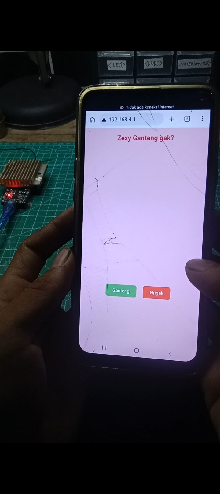

# ESP32 Prank Captive Portal 🚀

Proyek **Prank Captive Portal** berbasis ESP32. Ketika pengguna terhubung ke jaringan Wi-Fi, portal otomatis akan terbuka (*Captive Portal*) menampilkan halaman interaktif dengan tombol unik dan gambar meme offline (Base64).

---

## 🛠️ Fitur Utama
* **Captive Portal Otomatis:** Mengalihkan seluruh lalu lintas DNS ke IP ESP32 (`192.168.4.1`).
* **Offline Image Support:** Gambar tidak menggunakan URL internet, melainkan di-embed langsung sebagai **Data URI Base64** agar tetap muncul tanpa koneksi internet.
* **UI Interaktif:** Tombol "Nggak" yang akan berpindah posisi saat di-hover/ditekan (*escaping button*).
* **Tampilan Dinamis:** Saat tombol "Ganteng" ditekan, halaman akan berganti secara otomatis.

---

## 📚 Library yang Digunakan
Meskipun proyek ini tidak membutuhkan pustaka pihak ketiga dari eksternal, kode ini memanfaatkan beberapa library bawaan core ESP32 berikut:

* **`WiFi.h`** — Mengatur ESP32 dalam mode *Access Point* (AP).
* **`DNSServer.h`** — Menjalankan server DNS lokal untuk menangkap seluruh *request* domain (`*`) dan mengarahkannya ke IP lokal ESP32.
* **`WebServer.h`** — Menangani HTTP server untuk menyajikan halaman HTML, CSS, dan JavaScript ke perangkat klien.

---

## 🖼️ Cara Menyiapkan Gambar (Penting!)
Agar gambar dapat dimuat secara offline tanpa internet dan tidak memberatkan memori ESP32, lakukan langkah-langkah berikut sebelum memasukkan kode gambar ke sketch:

### 1. Resize Ukuran Gambar
1. Buka situs [iLoveIMG - Resize Image](https://www.iloveimg.com/resize-image).
2. Unggah gambar yang ingin digunakan.
3. Atur ukurannya menjadi **150 x 133 piksel** (pastikan opsi *Maintain aspect ratio* dicentang).
4. Unduh gambar yang sudah diperkecil.

### 2. Konversi Gambar ke Base64 (Data URI)
1. Buka situs [Base64 Image Encoder](https://www.base64-image.de/).
2. Unggah gambar yang sudah di-resize tadi.
3. Setelah proses konversi selesai, pilih tab **Data URI**.
4. Salin (*copy*) seluruh string Data URI yang diawali dengan `data:image/jpeg;base64,...`.

---

## 🚀 Cara Penggunaan
1. Buka file `.ino` di Arduino IDE.
2. Tempelkan string Data URI hasil konversi ke dalam tag `src="..."` di bagian kodenya.
3. *Compile* dan *Upload* ke board ESP32 kamu.
4. Hubungkan HP lain ke SSID **"Free Wifi Lah"**.
5. Halaman *captive portal* akan otomatis muncul!
